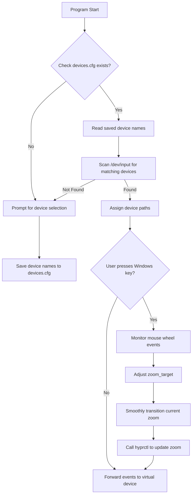

# Zoomer - Input Event Zoom Manager

> [!NOTE]  
> **Zoomer** is a C++ utility that intercepts input events, adjusts a zoom level using `hyprctl`, and forwards mouse events through a virtual device. It supports a configuration file to automatically select input devices on startup.


## Table of Contents

- [Zoomer - Input Event Zoom Manager](#zoomer---input-event-zoom-manager)
  - [Table of Contents](#table-of-contents)
  - [Features](#features)
  - [Requirements](#requirements)
  - [Installation](#installation)
  - [Usage](#usage)
  - [Configuration](#configuration)
  - [Finding libevdev](#finding-libevdev)
  - [Architecture Diagram](#architecture-diagram)
  - [License](#license)

## Features

- **Device Selection:**  
  On the first run, choose your keyboard and mouse interactively. The devices are stored by name in `devices.cfg`.

- **Auto-Discovery:**  
  On subsequent runs, the utility scans `/dev/input`, finds devices by their names, and automatically uses them without prompting.

- **Zoom Control:**  
  Hold the Windows key and scroll the mouse wheel to adjust the zoom level gradually with smooth transitions.

- **Virtual Mouse Device:**  
  Uses `uinput` to create a virtual mouse device that forwards events seamlessly.

> [!IMPORTANT]  
> **Running as Root:**  
> Due to the nature of intercepting input events and creating uinput devices, **Zoomer** requires root privileges. Always run with caution.

## Requirements

- **Operating System:** Ubuntu (or any compatible Linux distribution)
- **Compiler:** g++ supporting C++11 or later  
- **Libraries:**
  - [libevdev](https://github.com/freedesktop/libevdev) (for capturing input events)
- **Tools:**
  - `hyprctl` (ensure it is installed and available in your PATH)

## Installation

1. **Clone the Repository:**

   ```bash
   git clone https://github.com/voidCaloneian/hyprctl_magnifier/tree/main
   cd hyprctl_magnifier
   ```

2. **Find the libevdev Header:**

   To locate the `libevdev` header file on your system, run:

   ```bash
   find /usr/include -name libevdev.h
   ```

   You might see an output similar to:

   ```plaintext
   /usr/include/libevdev-1.0/libevdev/libevdev.h
   ```

3. **Build the Application:**

   Use the path found above to include the proper directory when compiling. For example, if the output is as shown above, compile with:

   ```bash
   g++ -std=c++11 -pthread -I/usr/include/libevdev-1.0 -o zoomer zoomer.cpp -levdev
   ```

   > [!WARNING]  
   > Make sure you have the necessary development libraries installed. On Ubuntu, you might need to run:
   >
   > ```bash
   > sudo apt-get install libevdev-dev
   > ```

## Usage

1. **Run the Application with Elevated Privileges:**

   ```bash
   sudo ./zoomer # Or Try without if you have 
                 # The HYRPLAND_INSTANCE_SIGNATURE problem
   ```

2. **Device Selection (On First Run):**  
   You will be presented with a list of input devices. Choose the keyboard and mouse by entering their corresponding indices.

3. **Adjust Zoom:**  
   While holding the **Windows** key, use the mouse wheel to increase or decrease the zoom level. The zoom transitions smoothly, and updates are applied via `hyprctl`.

> [!NOTE]  
> **Interactive Feedback:**  
> The application outputs feedback to the console regarding device selection, zoom changes, and configuration status.

## Configuration

The utility stores your device choices in a configuration file named `devices.cfg` in the same directory. Here is an example configuration file:

```ini
keyboard=Your Keyboard Device Name
mouse=Your Mouse Device Name
```

On subsequent launches, **Zoomer** will automatically look for these devices in `/dev/input` by matching the device names and, if found, will use them without prompting.

## Finding libevdev

If you are unsure where the libevdev header file is located, use the following command:

```bash
find /usr/include -name libevdev.h
```

For example, you might see:

```plaintext
/usr/include/libevdev-1.0/libevdev/libevdev.h
```

Based on this result, compile the application using:

```bash
g++ -std=c++11 -pthread -I/usr/include/libevdev-1.0 -o zoomer zoomer.cpp -levdev
```

This ensures that the compiler correctly locates the necessary header file.

## Architecture Diagram



> [!IMPORTANT]  
> **Permissions:**  
> The application needs permission to access `/dev/input` devices and to create virtual devices using `/dev/uinput`.

## License

Distributed under the MIT License. See `LICENSE` for more information.

---

Happy Coding! 😊  
Feel free to open an issue or submit a pull request if you have ideas for improvements. Enjoy using **Zoomer**!